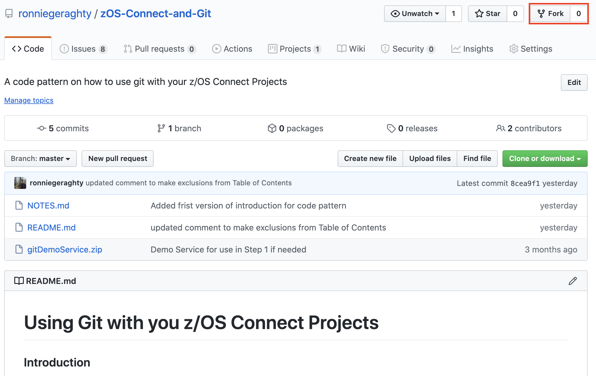
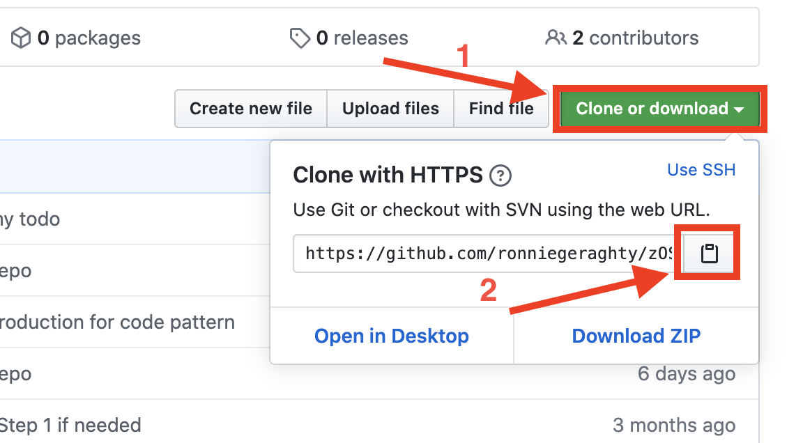
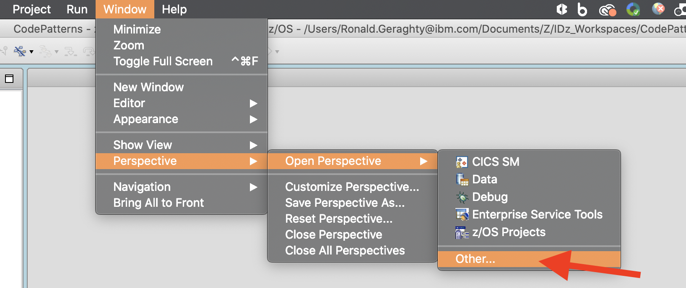
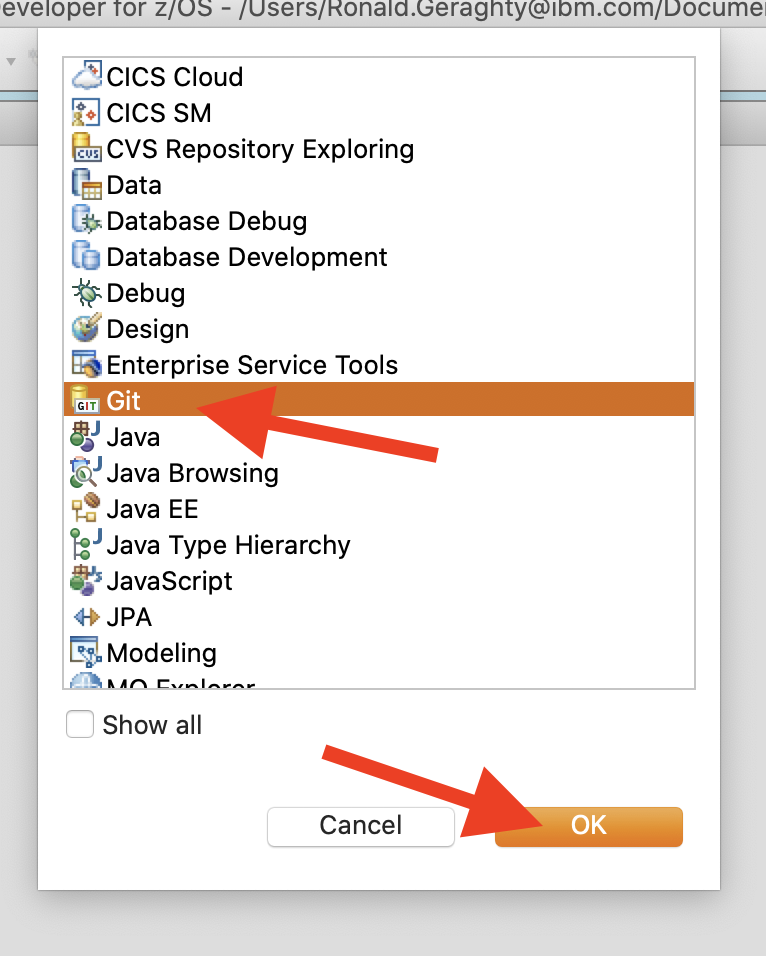
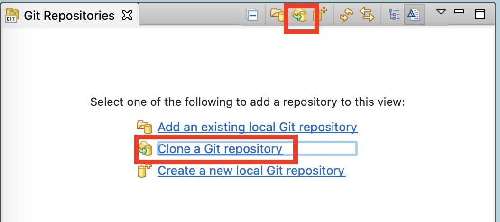
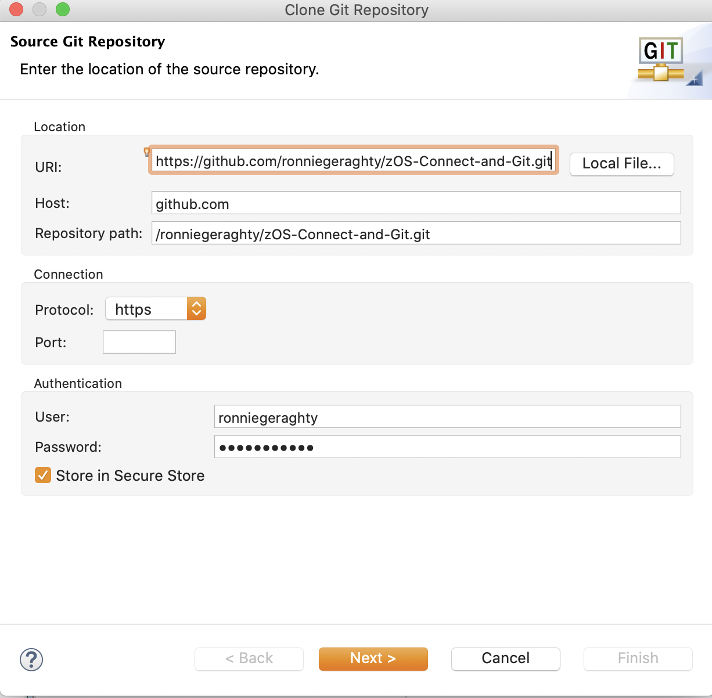
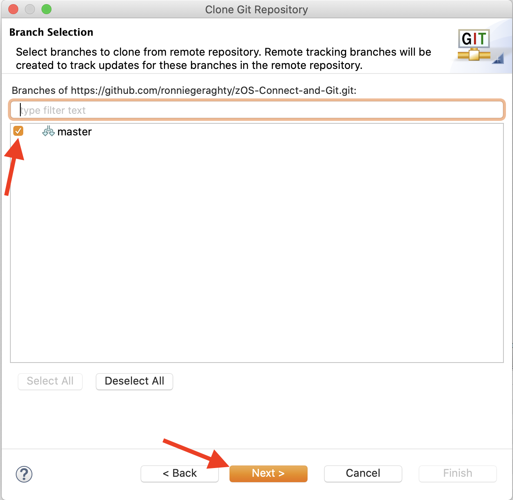
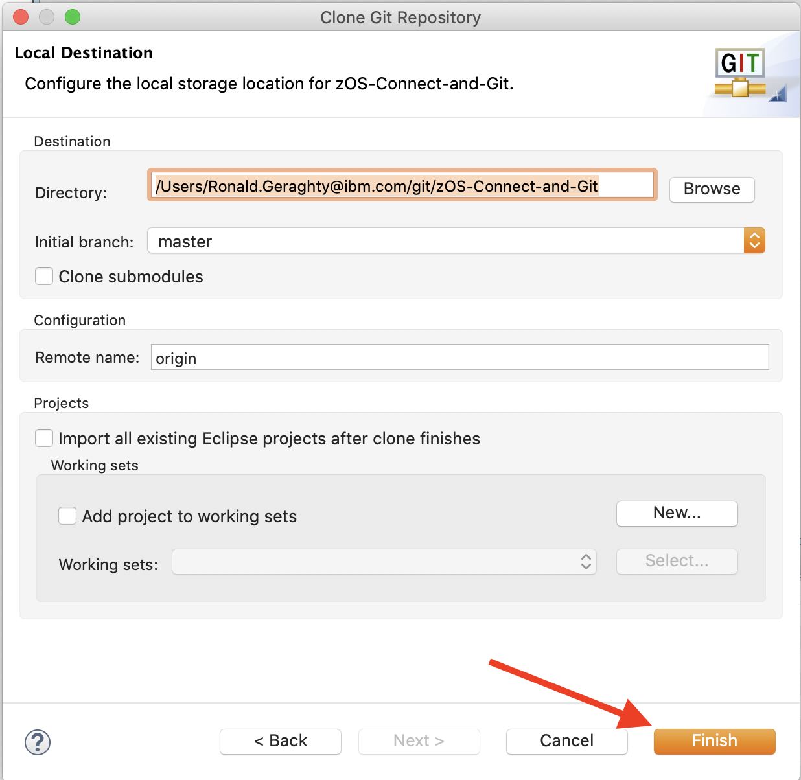

# Using Git with you z/OS Connect EE Projects <!-- omit in toc -->

### Introduction

This tutorial walks through how to work with the Git source code management tool in your z/OS Connect EE projects. You'll learn some of the best practices for organizing your z/OS Connect EE project in a git repository and how to use git to manage changes to your projects.

This work is being done as part of a series of code patterns and tutorials centered on bringing DevOps practices to z/OS Connect EE projects.

### Prerequisites:

- IBM Explorer for z/OS must be installed, or any other IBM Eclipse based editor. If it is not installed please reference this guide on doing so: [Installing IBM Explorer for z/OS Aqua](https://www.ibm.com/support/knowledgecenter/en/SSBDYH_3.2/com.ibm.zexpl.install.client.doc/topics/install20.html)
- The EGit plugin for Eclipse. If you do not have the plugin installed you can follow the instructions in our other code pattern in this series that goes over how to install the plugin and work with git using the plugin. [EGit Installation for IBM Explorer for z/OS]() _Link needs to be added once the code pattern is published_
- The z/OS Connect EE Perspective. _Not sure if this is something we should include steps for getting installed or if there is already an asset for this out there._
- A GitHub account. If you don't already have a GitHub account, you can [create a GitHub account here.](https://github.com/join)

### Estimated time

_TBD once code pattern is finished_

### Questions

If you have any questions, feel free to leave an Issue on this GitHub repository.

### Steps: <!-- omit in toc -->

- [1. Set Up](#1-set-up)
- [2. Navigating the z/OS Connect EE Perspective](#2-navigating-the-zos-connect-ee-perspective)
- [3. Repository Organization best practices](#3-repository-organization-best-practices)
- [4. Working with Git](#4-working-with-git)

## 1. Set Up

- **1.1 Fork This Repository:** Click the **Fork** button at the top of this GitHub Repository. This will create a GitHub repositroy under your own account identical to this one. This will give you permission to make changes to the repo.
  

- **1.2 Clone the Repository:** Once the fork has finished, Click the green **Clone or download** button. Then, in the drop down, click the **clipboard** button to copy the link to your GitHub repositroy.
  

- **1.3 Open your Editor:** Now open IBM Explorer for z/OS, or any other IBM Eclipse based editor, like IBM Deverloper for z/OS (IDz).
- **1.4 Navigate to the Git Perspective:** Once your Eclipse editor is open, navigated to the Git Perspective by clicking the **Window** tab, then click **Perspective** >> **Open Perspective** >> **Other...**
  

- **1.5 Select Git Perspective:** In the dropdown select **Git**, then click **OK**. 
- **1.6 Clone Repo:** Once the Git Perspective opens up, Click the **Clone a Git repository** button. _Either of the buttons shown in the picture below will work._
- **1.7 Enter Repository Info:** In the pop-up window paste the link we copied off your GitHub repository into the **URI:** field. The **Host:** and **Repository path:** fields should auto completed based on the URI you entered. Enter your GitHub username and password in the **Authentication** section at the bottom of the window, then click the **Next >** button.
- **1.8 Select a Branch:** Make sure that the checkbox next to the **master** option is checked. Then click **Next >**. 
- **1.9 Finish Cloning:** In the next window, leave the default options and click the **Finish** button. 
- **1.10 Examine Repository:** You should now see your repository in the **Git Repositories** view. Click the dropdown arrow to the left of the repository. Then click the dropdown arror next to the **Working Tree** section. _Note: The working tree shows the files and directories in the git repository._
- **1.11 Import Project:**

## 2. Navigating the z/OS Connect EE Perspective

## 3. Repository Organization best practices

## 4. Working with Git
